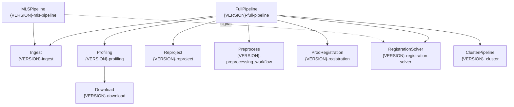

# Каталог Temporal Workflows — репозиторий `clod`

> Имена workflow формируются динамически через env-переменную `WORKFLOW_VERSION` (например `MVP-plus`).  
> Task queue для всех production workflows: **`point-cloud-task-queue`**

---

## 🗺️ Карта зависимостей

---

## 📦 Production Workflows (`point_cloud/workflows/`)

### 1. FullPipeline — `{VERSION}-full-pipeline`
**Файл:** [full_pipeline_workflow.py](file:///d:/9_anti/clod/point_cloud/workflows/full_pipeline_workflow.py)

Главный orchestrator полного пайплайна обработки облаков точек. Запускает все дочерние этапы последовательно. Также регистрируется как `{LEGACY_VERSION}-full-pipeline` для обратной совместимости (если `LEGACY_VERSION != VERSION`).

**Параметры (`FullPipelineParams`):**

| Параметр | Тип | По умолчанию | Описание |
|---|---|---|---|
| `company_id` | `str` | — | ID компании |
| `dataset_name` | `str` | — | Имя датасета |
| `dataset_crs_id` | `str` | — | CRS датасета |
| `target_srs` | `str` | — | Целевая система координат |
| `bump_version` | `bool` | `False` | Создать новую версию датасета |
| `schema_version` | `str` | `"1.1.0"` | Версия схемы |
| `force` | `bool` | `False` | Форсировать перезапись |
| `scans` | `List[FullPipelineScan]` | `None` | Список сканов с артефактами |
| `preprocessing_voxel_size_m` | `float` | `0.10` | Размер вокселя для препроцессинга |
| `preprocessing_mean_k` | `int` | `20` | Кол-во соседей для outlier removal |
| `preprocessing_multiplier` | `float` | `2.0` | Мультипликатор для outlier removal |
| `use_prod_registration` | `bool` | `False` | Использовать `ProdRegistration` вместо `RegistrationSolver` |
| `run_clustering` | `bool` | `False` | Запускать кластеризацию |

**Query:** `progress` → `{stage, scan_ids, dataset_version_id}`

**Этапы выполнения:** `ingest:N/M` → `profiling` → `reproject` → `preprocess` → `registration`/`prod-registration` → `clustering` (опционально) → `done`

**Дочерние workflows:** Ingest, Profiling, Reproject, Preprocess, ProdRegistration **или** RegistrationSolver, Cluster (опц.)

---

### 2. Ingest — `{VERSION}-ingest`
**Файл:** [ingest_workflow.py](file:///d:/9_anti/clod/point_cloud/workflows/ingest_workflow.py)

Ингест облака точек: создаёт/находит компанию, CRS, датасет, версию, скан, загружает сырые файлы в S3, запускает ingest run и строит манифест.

**Параметры (`IngestWorkflowParams`):**

| Параметр | Тип | По умолчанию | Описание |
|---|---|---|---|
| `company_id` | `str` | — | ID компании |
| `dataset_name` | `str` | — | Имя датасета |
| `bump_version` | `bool` | — | Создать новую версию? |
| `crs_id` | `str` | `None` | ID CRS (напр. `EPSG:32637`) |
| `crs_epsg` | `int` | `None` | EPSG-код |
| `crs_name` | `str` | `None` | Отображаемое имя CRS |
| `crs_zone_degree` | `int` | `0` | Зона в градусах |
| `crs_units` | `str` | `"m"` | Единицы измерения |
| `crs_axis_order` | `str` | `"x_east,y_north,z_up"` | Порядок осей |
| `schema_version` | `str` | `"1.1.0"` | Версия схемы |
| `force` | `bool` | `False` | Форсировать |
| `artifacts` | `List[Dict]` | `None` | Список артефактов (`kind`, `local_file_path`, `filename`) |
| `scan_meta` | `Dict` | `None` | Метаданные скана |

**Signal:** `add_raw_artifacts(artifacts: List[Dict])` — добавить артефакты динамически (workflow ждёт загрузку если artifacts не переданы в params)

**Queries:** `progress` → `{stage, scan_id, errors}`, `ingested_artifacts` → `{artifacts}`

**Этапы:** ensure_company → ensure_crs → ensure_dataset → ensure_dataset_version → create_scan → upload_raw_artifacts → create_ingest_run → process_ingest_run

**Возвращает:** `{scan_id, dataset_id, dataset_version_id, ingest_run_id, upload_results, process_result, errors}`

---

### 3. Profiling — `{VERSION}-profiling`
**Файл:** [profiling_workflow.py](file:///d:/9_anti/clod/point_cloud/workflows/profiling_workflow.py)

Создаёт профиль скана: вычисляет метаданные облака точек, генерирует hexbin GeoJSON, загружает в S3 и создаёт профилировочный манифест.

**Параметры (`ProfilingWorkflowParams`):**

| Параметр | Тип | Описание |
|---|---|---|
| `scan_id` | `str` | ID скана |
| `cloud_path` | `str` | Локальная директория для скачивания |
| `geojson_dst` | `str` | Путь для GeoJSON hexbin |

**Query:** `progress` → `{stage}`

**Дочерний workflow:** Download → скачивает `raw.point_cloud`

**Активности:** `point_cloud_meta`, `read_cloud_hexbin`, `extract_hexbin_fields`, `upload_hexbin`, `upload_profiling_manifest`

---

### 4. Download — `{VERSION}-download`
**Файл:** [download_workflow.py](file:///d:/9_anti/clod/point_cloud/workflows/download_workflow.py)

Скачивает сырые артефакты скана из S3 параллельно (semaphore 3). Поддерживает фильтрацию по `kinds`.

**Параметры (`DownloadWorkflowParams`):**

| Параметр | Тип | Описание |
|---|---|---|
| `scan_id` | `str` | ID скана |
| `dst_dir` | `str` | Локальная директория назначения |
| `kinds` | `List[str]` | Фильтр по типам артефактов (None = все) |

**Query:** `progress` → `{stage, scan_id, total_artifacts, downloaded_artifacts, current_kind}`

**Возвращает:** `Dict[kind → local_path]`

---

### 5. Reproject — `{VERSION}-reproject`
**Файл:** [reproject_workflow.py](file:///d:/9_anti/clod/point_cloud/workflows/reproject_workflow.py)

Перепроецирует облака точек всех сканов датасета из исходной CRS в целевую.

**Параметры (`ReprojectWorkflowParams`):**

| Параметр | Тип | По умолчанию | Описание |
|---|---|---|---|
| `company_id` | `str` | — | ID компании |
| `dataset_version_id` | `str` | — | ID версии датасета |
| `schema_version` | `str` | `"1.1.0"` | Версия схемы |
| `scan_ids` | `List[str]` | `None` | Список ID сканов (None = все в версии) |
| `in_crs_id` | `str` | `None` | Исходный CRS ID |
| `out_crs_id` | `str` | `None` | Целевой CRS ID |
| `in_srs` | `str` | `None` | Исходный SRS (строка PDAL/PROJ) — приоритет над `in_crs_id` |
| `out_srs` | `str` | `None` | Целевой SRS — приоритет над `out_crs_id` |

**Query:** `progress` → `{stage, processed}`

**Активности:** `resolve_crs_to_pdal_srs` (опц.), `list_scans_by_dataset_version` (опц.), `reproject_scan_to_target_crs` (timeout: 2ч на скан)

---

### 6. Preprocess — `{VERSION}-preprocessing_workflow`
**Файл:** [preprocess_workflow.py](file:///d:/9_anti/clod/point_cloud/workflows/preprocess_workflow.py)

Voxel downsampling + Statistical Outlier Removal для каждого скана. Принимает `derived.reprojected_point_cloud`, выдаёт `derived.preprocessed_point_cloud`.

**Параметры (`PreprocessPipelineParams`):**

| Параметр | Тип | По умолчанию | Описание |
|---|---|---|---|
| `company_id` | `str` | — | ID компании |
| `dataset_version_id` | `str` | — | ID версии датасета |
| `schema_version` | `str` | `"1.1.0"` | Версия схемы |
| `scan_ids` | `List[str]` | `None` | ID сканов (None = все) |
| `input_kind` | `str` | `"derived.reprojected_point_cloud"` | Тип входного артефакта |
| `output_kind` | `str` | `"derived.preprocessed_point_cloud"` | Тип выходного артефакта |
| `voxel_size_m` | `float` | `0.10` | Размер вокселя в метрах |
| `mean_k` | `int` | `20` | Кол-во ближайших соседей для SOR |
| `multiplier` | `float` | `2.0` | Порог стандартного отклонения для SOR |

**Query:** `progress` → `{stage, processed}`

---

### 7. ProdRegistration — `{VERSION}-registration`
**Файл:** [prod_reg_workflow.py](file:///d:/9_anti/clod/point_cloud/workflows/prod_reg_workflow.py)

Production-вариант регистрации сканов. Строит anchors, предлагает рёбра кандидаты, выполняет попарный каскадный ICP, решает pose graph, сохраняет решение, экспортирует merged LAZ.

**Параметры (`ProdRegistrationWorkflowParams`):**

| Параметр | Тип | По умолчанию | Описание |
|---|---|---|---|
| `company_id` | `str` | — | ID компании |
| `dataset_version_id` | `str` | — | ID версии |
| `schema_version` | `str` | — | Версия схемы |
| `max_pairs` | `int` | `50` | Макс. кол-во пар для регистрации |
| `crop_radius_m` | `float` | `40.0` | Радиус обрезки пары в метрах |
| `global_voxel_m` | `float` | `1.0` | Voxel для глобальной регистрации |
| `cascade_voxels_m` | `tuple` | `(1.0, 0.3, 0.1)` | Voxels для каскадного ICP |
| `cascade_max_corr_multipliers` | `tuple` | `(3.0, 2.0, 1.5)` | Макс. расстояния для каскада |
| `min_fitness` | `float` | `0.2` | Мин. фитнес для принятия пары |
| `force` | `bool` | `False` | Форсировать перезапись |

**Query:** `progress` → `{stage, edges}`

**Этапы:** build_anchors → propose_edges → pairwise_registration → solve_pose_graph → persist_solution → export_laz

---

### 8. RegistrationSolver — `{VERSION}-registration-solver`
**Файл:** [registration_solver_workflow.py](file:///d:/9_anti/clod/point_cloud/workflows/registration_solver_workflow.py)

> ⚠️ VERSION захардкожен в файле как `'MVP-plus'` (не из env).

Упрощённый вариант: собирает граф, уточняет рёбра через ICP, решает pose graph, сохраняет решение, экспортирует merged LAZ.

**Параметры (`RegistrationSolverParams`):**

| Параметр | Тип | По умолчанию | Описание |
|---|---|---|---|
| `company_id` | `str` | — | ID компании |
| `dataset_version_id` | `str` | — | ID версии |
| `schema_version` | `str` | `"1.1.0"` | Версия схемы |
| `force` | `bool` | `False` | Форсировать |

**Query:** `progress` → `{stage}`

**Этапы:** collect_graph → icp_refine (30 мин) → solve → persist → export_laz

---

### 9. ClusterPipeline — `{VERSION}_cluster`
**Файл:** [cluster_workflow.py](file:///d:/9_anti/clod/point_cloud/workflows/cluster_workflow.py)

Классификация и кластеризация точечного облака. Работает батчами через `continue_as_new` (чтобы обойти ограничения Temporal на историю).

**Параметры (`ClusterPipelineParams`):**

| Параметр | Тип | По умолчанию | Описание |
|---|---|---|---|
| `dataset_version_id` | `str` | — | ID версии датасета |
| `schema_version` | `str` | `"1.1.0"` | Версия схемы |
| `dst_dir` | `str` | `"point_cloud/tmp/cluster"` | Рабочая директория |
| `tile_size` | `float` | `50.0` | Размер тайла в метрах |
| `splitter_buffer` | `float` | `3.0` | Буфер перекрытия тайлов |
| `batch_size` | `int` | `25` | Кол-во тайлов на одну итерацию |
| `csf_params` | `Dict` | `{}` | Параметры Cloth Simulation Filter |
| `cluster_params` | `ClusterHeuristicsParams` | defaults | Параметры кластеризации |
| `tiles` / `tile_index` / `cropped_tiles` / `meta` | — | — | Состояние для `continue_as_new` |

**Query:** `progress` → `{stage}`

**Этапы:** download_merged → extract_scale_offset → split_into_tiles → [батч: split_ground_offground → cluster_tile × 2 → merge_tiles → crop_buffer] → continue_as_new (если остались тайлы) → merge_tiles финальный

---

### 10. MLSPipeline — `{VERSION}-mls-pipeline`
**Файл:** [mls_new.py](file:///d:/9_anti/clod/point_cloud/workflows/mls_new.py)

Специализированный пайплайн для Mobile Laser Scanning (МЛС). Ingests один скан, перепроецирует, препроцессирует, строит anchors и propose_edges. Поддерживает ленивый запуск регистрации через Signal.

**Параметры (`MlsPipelineParams`):**

| Параметр | Тип | По умолчанию | Описание |
|---|---|---|---|
| `company_id` | `str` | — | ID компании |
| `dataset_name` | `str` | — | Имя датасета |
| `bump_version` | `bool` | — | Новая версия? |
| `dataset_crs_id` | `str` | — | Исходный CRS |
| `target_srs` | `str` | — | Целевой SRS |
| `schema_version` | `str` | `"1.1.0"` | Версия схемы |
| `force` | `bool` | `False` | Форсировать |
| `artifacts` | `List[Dict]` | `None` | Сырые артефакты |

**Signal:** `trigger_registration(force: bool)` — запускает `RegistrationSolver` как child workflow с дедупликацией по `workflow_id = reg-{dataset_version_id}`. Сигнал можно отправить до завершения основного run — solver стартует автоматически по завершении.

**Query:** `progress` → `{stage, scan_id, dataset_version_id, registration_started, registration_workflow_id}`

**Этапы:** ingest (child) → resolve_srs → reproject → preprocess → anchors → propose_edges → [если был signal: start registration solver]

---

### 11. ReconcileIngest — `ReconcileIngestWorkflow`
**Файл:** [reconcile_ingest_workflow.py](file:///d:/9_anti/clod/point_cloud/workflows/reconcile_ingest_workflow.py)

> ℹ️ Без `name=...` в `@workflow.defn` — Temporal использует имя класса `ReconcileIngestWorkflow`.

Служебный workflow для реконсиляции «зависших» ingest-манифестов. Запускает одну активность.

**Параметры (`ReconcileIngestParams`):** `limit: int = 100`

**Активность:** `reconcile_pending_ingest_manifests(limit)` (timeout: 5 мин)

---

## 🧪 Прототипы / Экспериментальные (`test_ideas/`)

> Не регистрируются в worker'е, служат как эксперименты.

### 12. RegistrationCoarseToFine — `registration-coarse-to-fine`
**Файл:** [registration_workflow.py](file:///d:/9_anti/clod/test_ideas/registration_workflow.py)

Прототип регистрации: preprocessing → отбор пар-кандидатов → попарная регистрация FPFH+RANSAC → ICP. Без pose graph и merge.

**Query:** `progress` → `{stage, edges}`

---

### 13. ClusterPipeline (v0) — `{VERSION}_cluster`
**Файл:** [hse_workflow.py](file:///d:/9_anti/clod/test_ideas/hse_workflow.py)

Предшественник ClusterPipeline из `point_cloud/workflows/`. Без батчинга и `continue_as_new`, без retry policy на активностях. Использует `SCHEMA_VERSION` из env. Той же регистрации, что и production — конфликт имён.

---

## 📋 Сводная таблица

| # | Workflow | Temporal-имя | Статус | Запуск |
|---|---|---|---|---|
| 1 | FullPipeline | `{V}-full-pipeline` | Production | Внешний клиент |
| 2 | Ingest | `{V}-ingest` | Production | Внешний / child от FullPipeline, MLS |
| 3 | Profiling | `{V}-profiling` | Production | Child от FullPipeline |
| 4 | Download | `{V}-download` | Production | Child от Profiling |
| 5 | Reproject | `{V}-reproject` | Production | Child от FullPipeline |
| 6 | Preprocess | `{V}-preprocessing_workflow` | Production | Child от FullPipeline |
| 7 | ProdRegistration | `{V}-registration` | Production | Child от FullPipeline (если `use_prod_registration=True`) |
| 8 | RegistrationSolver | `{V}-registration-solver` | Production | Child от FullPipeline / MLS (по Signal) |
| 9 | ClusterPipeline | `{V}_cluster` | Production | Child от FullPipeline (если `run_clustering=True`) |
| 10 | MLSPipeline | `{V}-mls-pipeline` | Production | Внешний клиент (для МЛС-сканеров) |
| 11 | ReconcileIngest | `ReconcileIngestWorkflow` | Production (служебный) | Планировщик/cron |
| 12 | RegistrationCoarseToFine | `registration-coarse-to-fine` | Прототип | — |
| 13 | ClusterPipeline v0 | `{V}_cluster` | Прототип | — |

---

## 🔑 Shared Catalog (`shared/workflows/catalog.py`)

Определяет `WorkflowBinding` — связку `{workflow_name, task_queue, query_name}`.

Единственная запись: `INGEST_V1 = WorkflowBinding(workflow_name='Ingest-1', task_queue='ingest-queue', ...)` — похоже, legacy/заготовка для отдельного ingest-сервиса на отдельном task_queue.
